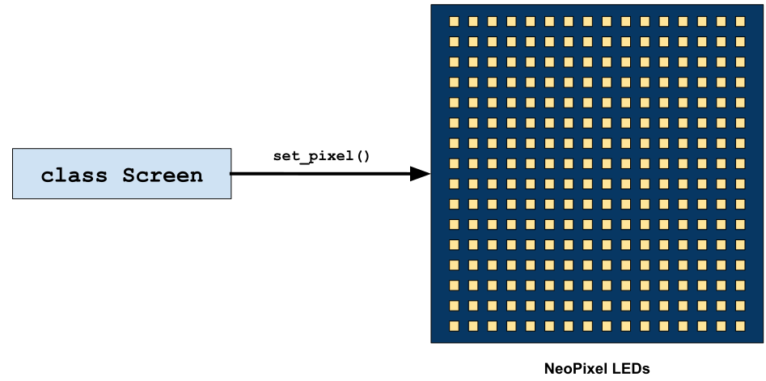
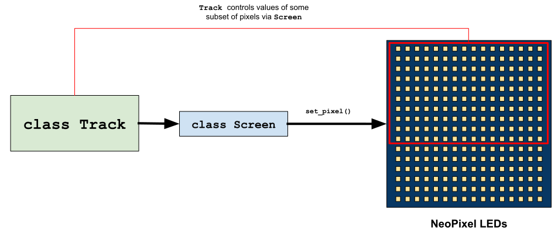
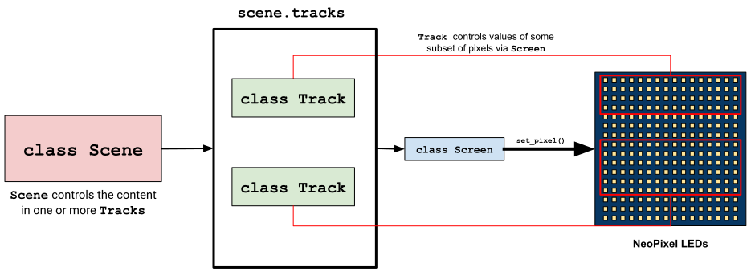
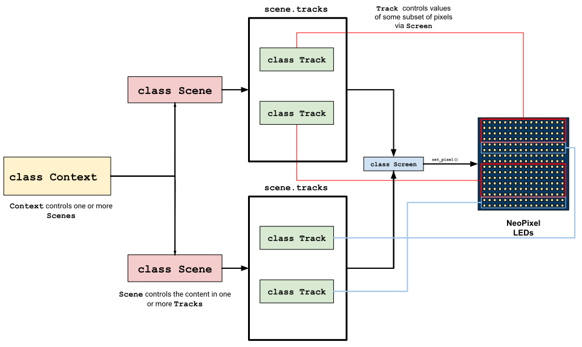

# `leddite`
The `leddite` project provides an easy to use library and hardware design, to build and interact with AdaFruit Neopixel (WS281X) led strips. The library provides high-level abstractions that make it easier to display user-specified contents. It also provides a command-line tool and REST API, The hardware design is flexible easy to replicate and can be done using a variety of materials and methods.

# Docs:
## Examples:
    * 
    * 
## Quick start

## Library
### Overview
The `leddite` Python module is a comprehensive package that lets you control Adafruit Neopixel LEDs using high level abstractions. 

### Installation
* You can install `leddite` using `pip`
```
pip install leddite
```

### CLI Usage
Usage:
    leddite serve [--port=<port>] [--screen_type=(virtual|physical)] [--height=<virtual_screen_height>] [--width=<virtual_screen_width>] [--hostname=<hostname>] [--debug]
    leddite context set <context-name> [<context-args>] [--hostname=<hostname>] [--debug]
    leddite context info (all|active) [--hostname=<hostname>] [--debug]
    leddite carousel (start|stop|info) [--hostname=<hostname>] [--debug]

#### Serve the `leddite` API 
```
# Use the default port and host (127.0.0.1:5000), run on real hardware
leddite serve --screen_type=physical

# Use a custom port and host, run on real hardware
leddite serve --port 9523 --hostname 192.168.1.50 --screen_type=physical

# Use a custom port and host, run default 16x16 virtual screen for debugging
leddite serve --port 9523 --hostname 192.168.1.50 --screen_type=virtual --debug

# Use a custom port and host, run default 16x16 virtual screen for debugging with non-default dimensions
leddite serve --port 9523 --hostname 192.168.1.50 --screen_type=virtual --debug --width=16 --height=10
```


### HW Module
* 
    
  `Screen` is the only interface between the LEDs and the other modules. **A single instance of the appropriate `Screen` sub-class is meant to be shared across the other modules.** 
    * `PhysicalScreen` controls LED hardware via the `rpi_ws281x` RPi PWM library for WS281X LEDs
    * `VirtualScreen` controls a virtual screen displayed in the terminal for debugging

* 
   
  `Track` controls a subset of pixels on a `Screen`

* 
  
  `Scene` manages many tracks and what they display.

* 
    
  `Context` manages one or more `Scene`s to show complex screens


### API
### Web UI


## Hardware
### Overview
### Build Guide
#### Materials and Cost
#### Build instructions
#### Tips and tricks
#### Pitfalls I faced
#### Troubleshooting

